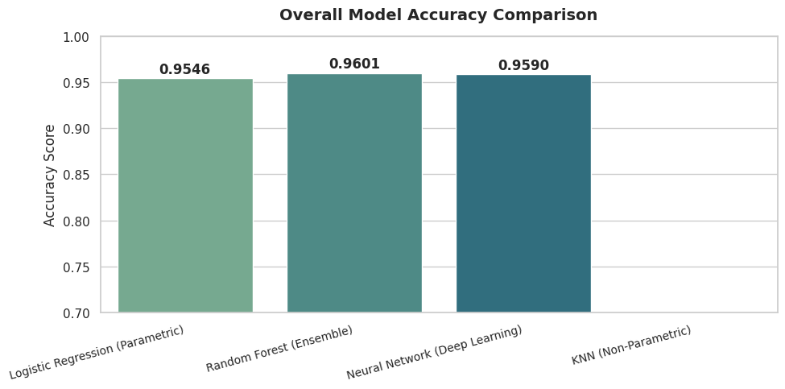
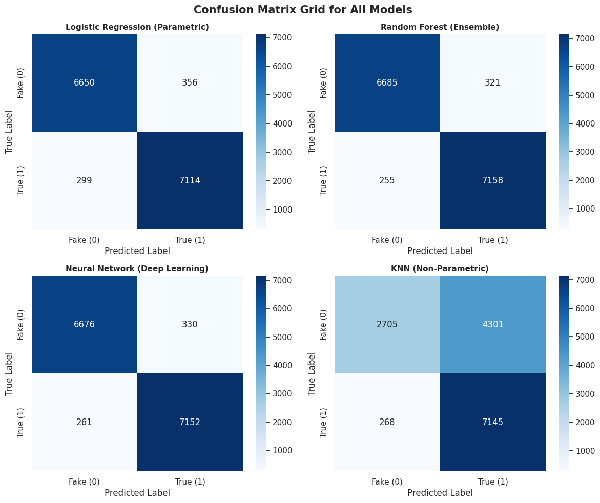
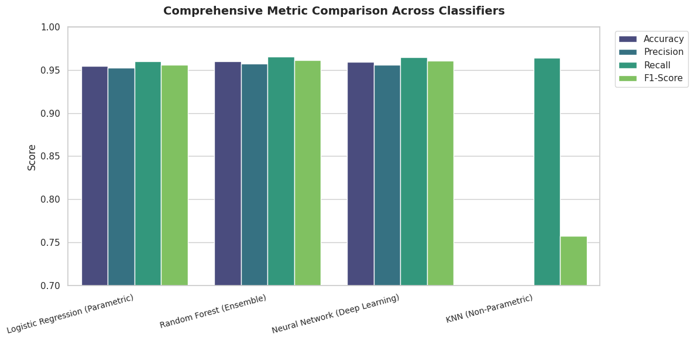
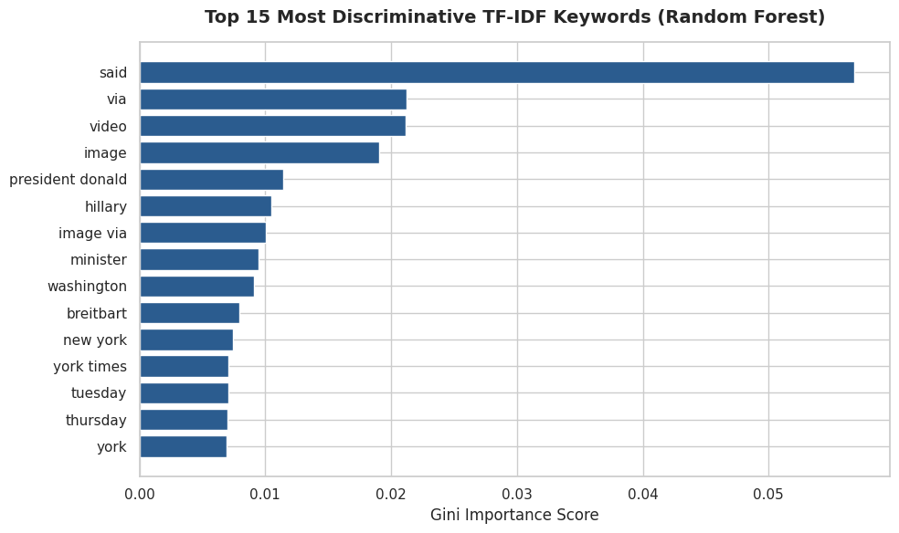

# 📰 AI-Powered Fake News Detection Using Text Classification

A from-scratch machine learning pipeline that classifies a news article as **Real** or **Fake** using only its textual content — no external fact-checking APIs, no publisher metadata, no knowledge-graph lookups. Just the language itself.

Built during the **AI & ML Summer Internship Program at the Indian Institute of Computing and Technology (IICT)**, this project takes the full supervised-learning journey: raw data → cleaning → TF-IDF vectorization → four competing classifiers → evaluation → a live, deployed Streamlit app.

<p align="center">
  
</p>

<p align="center">
  
  
  
  
  
</p>

---

## 📌 Table of Contents

- [Overview](#-overview)
- [Why Fake News Detection Matters](#-why-fake-news-detection-matters)
- [Dataset](#-dataset)
- [Methodology](#-methodology)
  - [1. Text Preprocessing](#1-text-preprocessing)
  - [2. Feature Extraction (TF-IDF)](#2-feature-extraction-tf-idf)
  - [3. Train-Test Split](#3-train-test-split)
  - [4. Models Trained](#4-models-trained)
- [Results](#-results)
- [Parametric vs. Non-Parametric — Key Insight](#-parametric-vs-non-parametric--key-insight)
- [System Architecture & Deployment](#-system-architecture--deployment)
- [Tech Stack](#-tech-stack)
- [Project Structure](#-project-structure)
- [Getting Started](#-getting-started)
- [What I Learned](#-what-i-learned)
- [Limitations](#-limitations)
- [Future Scope](#-future-scope)
- [References](#-references)
- [Author](#-author)

---

## 🔍 Overview

**Problem Statement:** Build a supervised ML pipeline that labels a news article as real or fake **using only the statistical properties of the text itself** — no author history, no publisher reputation, no social engagement signals.

This constraint is deliberate. It isolates *how much discriminative signal language alone carries*, which is the hardest and most generalizable version of the problem. The pipeline covers:

- Data acquisition & cleaning
- Text preprocessing & normalization
- Feature extraction (TF-IDF)
- Training 4 classifiers across parametric and non-parametric model families
- Rigorous multi-metric evaluation (not just accuracy)
- Packaging the winning model into a real-time, browser-based inference app

---

## ⚠️ Why Fake News Detection Matters

- **Asymmetric cost of production vs. verification** — Fabricating an article takes minutes; manual fact-checking takes hours or days.
- **Virality outpaces correction** — False stories consistently spread faster and reach wider audiences than the corrections that follow them.
- **Scale** — Manual fact-checking cannot keep up with the volume published daily across news aggregators, blogs, and social platforms.
- **Erosion of institutional trust** — Repeated exposure to fabricated content degrades trust in legitimate journalism, an effect that is slow to reverse.
- **Downstream risk** — In public health, finance, and elections, a single viral fabrication can cause real damage before any correction lands.

These factors make the case for lightweight, automated, first-pass classifiers that can run at the point of publication or consumption — not just centralized human fact-checking.

---

## 📊 Dataset

This project uses **[WELFake](https://www.kaggle.com/datasets/saurabhshahane/fake-news-classification)** (Word Embedding over Linguistic Features for Fake News Detection) — a corpus built by merging four widely-used news datasets (**Kaggle, McIntire, Reuters, BuzzFeed Political**) specifically to reduce single-source overfitting.

| Detail | Value |
| :--- | :--- |
| **Source** | WELFake (Kaggle) — Merged from Kaggle, McIntire, Reuters & BuzzFeed Political |
| **Total articles (post-cleaning)** | 72,095 |
| **Fake articles (label = 0)** | 35,028 (48.6%) |
| **Real articles (label = 1)** | 37,067 (51.4%) |
| **Fields used** | `title`, `text`, `label` |
| **Train / Test split** | 80% / 20%, stratified |
| **Test set size** | 14,419 articles |

Each record was cleaned by combining `title` + `text`, dropping nulls, and shuffling with a fixed seed for reproducibility.

---

## 🧪 Methodology

### 1. Text Preprocessing

Raw article text goes through a deliberate cleaning order:

1. Lowercasing
2. **Removal of source-agency bylines** (e.g. `(City – Reuters)` and the literal token `reuters`) — prevents the model from learning a trivial *source-identity shortcut* instead of a genuine content-based signal.
3. URL removal
4. Removal of all non-alphabetic characters
5. Stop-word removal after whitespace tokenization
6. Discarding single-character tokens as noise

<details>
<summary><b>Example: Raw vs. Cleaned Text</b></summary>

**Raw:**
> Trump's ongoing meltdown over fake news (the rest of us call it reporting) organizations entered what seems like its eighteenth year on Wednesday after NBC correctly reported...

**Cleaned:**
> trump ongoing meltdown fake news rest us call reporting organizations entered seems like eighteenth year wednesday nbc correctly reported...

</details>

---

### 2. Feature Extraction (TF-IDF)

Cleaned text is vectorized using **TF-IDF**, chosen over raw bag-of-words counts because it downweights high-frequency, low-information terms while preserving discriminative rare terms.

- Top **3,000–5,000** highest-scoring terms retained
- `min_df = 3` — Discards overly rare / noisy terms
- `max_df = 0.9` — Discards corpus-specific "stop-words" that carry little discriminative value

---

### 3. Train-Test Split

Stratified 80/20 split (`random_state = 42`) to preserve class balance across both partitions and keep results reproducible.

---

### 4. Models Trained

Four classifiers spanning **parametric** and **non-parametric** families were trained under identical feature and split conditions:

| Model | Family | Core Idea |
| :--- | :--- | :--- |
| **Logistic Regression** | Parametric | Learns a fixed-size weight vector over TF-IDF terms; linear log-odds decision boundary |
| **Random Forest** | Ensemble / Non-parametric | 100 bootstrapped decision trees, majority-vote aggregated; complexity grows with data |
| **Neural Network (MLP)** | Parametric | Single hidden layer (64–100 neurons), trained via back-propagation with early stopping |
| **K-Nearest Neighbours** | Non-parametric | Majority vote among 5–7 nearest neighbours in TF-IDF space; no explicit training phase |

---

## 🏆 Results

<p align="center">
  
</p>

*(Metrics computed on the 14,419-article held-out test set.)*

| Model | Accuracy | Precision | Recall | F1-Score |
| :--- | :---: | :---: | :---: | :---: |
| 🥇 **Random Forest (Ensemble)** | **96.01%** | **0.9571** | **0.9656** | **0.9613** |
| 🥈 **Neural Network (MLP)** | 95.90% | 0.9559 | 0.9648 | 0.9605 |
| 🥉 **Logistic Regression** | 95.46% | 0.9524 | 0.9597 | 0.9556 |
| **K-Nearest Neighbours** | 68.31% | 0.6242 | 0.9639 | 0.7580 |

<p align="center">
  
</p>

**Random Forest came out on top** and was serialized for deployment due to its competitive accuracy, strong recall on the "real" class, and resistance to high-dimensional sparseness compared to distance-based methods.

### Most Discriminative Terms

Random Forest's Gini importance surfaced the terms the model actually leans on:

<p align="center">
  
</p>

Notably, wire-service and formatting artifacts (`said`, `via`, `image`, `washington`) dominate — a reminder that lexical classifiers partly key off *stylistic* fingerprints of how an article was written/sourced, not just semantic truthfulness.

---

## 🧠 Parametric vs. Non-Parametric — Key Insight

- **Parametric models** (Logistic Regression, Neural Network) learn a *fixed-size* parameter set that doesn't grow with the training data — they assume a specific functional form (linear, or layered non-linear).
- **Non-parametric models** (Random Forest, KNN) let complexity scale with the data itself — Random Forest via tree depth/count, KNN via retaining the entire dataset.

**Key Takeaways:**
- **Logistic Regression** trained almost instantly and stayed fully interpretable via per-term coefficients.
- **Neural Network** captured mild non-linear interactions at the cost of higher training time.
- **Random Forest** was the slowest to train (~24s vs. ≤5s for others) but yielded the highest accuracy and feature importance interpretability.
- **KNN broke down:** In a 3,000+ TF-IDF space, pairwise Euclidean distances stop being discriminative (the **curse of dimensionality**), causing the neighborhood structure to collapse.

> **Conclusion:** For sparse, high-dimensional lexical features like TF-IDF, models learning a **global weighting** over features generalize noticeably better than instance-based distance methods operating in raw feature space.

---

## 🏗️ System Architecture & Deployment

The best-performing model + the fitted TF-IDF vectorizer were serialized (`pickle`) and wired into a **Streamlit** web app.

```text
User Input (Browser) 
    │
    ▼
Streamlit UI
    │
    ▼
Preprocessing Module (Clean & Tokenize)
    │
    ▼
Pre-fitted TF-IDF Vectorizer
    │
    ▼
Trained Model Inference
    │
    ▼
Prediction & Confidence Score Output
